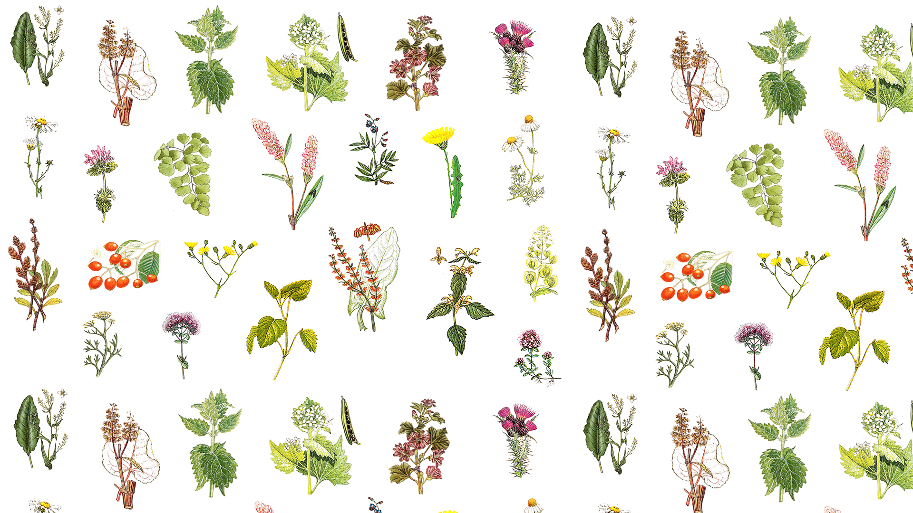

# Wild Plants: An Educational Matching Game
----------------------------------------------------------------------------------------------------------------------------------------
[VIEW LIVE DEMO](https://sophie-apples.github.io/botanical-puzzle/)
----------------------------------------------------------------------------------------------------------------------------------------
----------------------------------------------------------------------------------------------------------------------------------------

*Summary:*

*This is an educational game, which aims to increase the user's knowledge of the wild plants of the British Isles and promote an interest in environment and conservation.*

## Strategy
-----------------------------------------

### Business Objectives
* Educate users about wild plants, their appearance, uses and habitats. 
* Encourage an interest in and appreciation of the natural world and wild plants. 
* To improve the user's knowledge of different wild plants of the British Isles. 
* Display images of plants and informative descriptions. 
* Promote an interest in the topic and provide further learning resources. 

### Client Objectives
* Wants to play a game which involves matching. 
* Desire to learn more about the natural world, specificaly plants of the British Isles. 
* Relaxing and atmospheric experience. 
* Learn something- gain information about wild plants. 
* Find out about many different plants. 
* Play a game which is interesting and informative. 
* Play a game which is easy and pleasant to use. 

### User stories
* "I want the game to be easy to use and have clear instructions."
* "I want to find out something different each time I play."
* "I want to feel like I am learning and improving as I play, and start to recognise the plants and remember things about them."
* "I want feedback on how I am doing."
* "I want a chance to find out more about the topic."
* "I want to discover interesting facts."
* "I want to play a game whch is visually attractive."

## Scope/ Structure
-----------------------------------------

### Sections & features to be included:
* Home Page: Clear instructions on how to play the game, with explanatory icons. Button to navigate to play the game. Button to find out more about the topic and this project which navigates to 'about' page.
* About section: Description of the resources used for the project, credits to the images used in the project, and clear credit to the sources of information. Direct the user to the source text to find out more/ learn more about the topic. A link direct to the game.
* Game: The user is shown a 'token' image of a wild plant, and a large plant map containing images of many different plants. The user must utilise this cue to identify and locate the wild plant on the plant map. If they click on the wrong plant, a modal appears asking them to Try Again. If they click on the correct pant, a correct sound chimes, a modal appears giving the name of the plant they have just located, and their score increases by one point. The aim of the game is to find 10 plants in this way. At the end of the game, the user is shown a table containing all the plants they located during the game, with a thubnail image, plant name, and short description of the plant.
The user can then navigate back to the homepage, where they can find out more on the topic, or they can play again.
As there are over 100 plants on the plant map and the images are randomly generated, they will discover a different selection of plants each time they play.

**Client perspective:** The homepage is informative and easy to navigate. The game is clearly explained and provides an interesting educational experience. The background sounds enhance the user experience, providing a topical and relaxing soundtrack to their 'wild plant forage'. They will learn about familiar and not so familiar plants from the British Isles, and gain an interest in the environment around them.

**Business perspective:** The homepage provides an opportunity to promote the materials and information behind the project and allows the user to easily navigae to the game. The game provides a wide variety of information on different plants and promotes a positive association with the plant life they are learning about. This is helped by the experience-oriented soundtrack and calming atmosphere. They will learn about familiar and not so familiar plants from the British Isles, and gain an interest in and appreciation of the environment around them.

## Skeleton/ Structure
-----------------------------------------

### Wireframes
Wireframes for mobile, iPad and Desktop can be seen [HERE](https://xd.adobe.com/view/5c23c360-4653-4a02-8cd0-d7dbf0153f9e-0970/).

### Features (& Rationale)
## Home Page
* pulsing 'play' button
* 'about' button to encourage user to explore more on the topic
* Instructions and icons to explain how to play

## About
* Information on the book which inspired this project, with credits to the artists whose work is included, and the author who provides the information included.
* Information on where to purchase the book, and therefore find out more.
* Game instructions and pulsing 'play' button.

## Game
* Gamescreen can be resized to switch between seeing the plants in more detail and viewing the wider plant map, especially for mobile devices.
* Background sound can be switched on and off.
* Over 100 different plants to learn about, with a different selection each time the game is played.
* Sounds to confirm a correct selection. No sound is given if the wrong plant is selected.
* A modal is displayed when a correct plant is chosen, giving the name of that plant.
* A modal is displayed if an incorrect plant is chosen, saying 'Try Again'.
* Icon of the plant to be found shown in the top left corner so as not to obscure the map and be constantly available to compare to the images on the map.
* Exit button bottom right hand corner to navigate to the 'basket' where info about the plants found can be seen.
* Sound control button in top right hand corner to switch sound on and off with corresponding icons.
* When all 10 plants have been found, modal displayed congratulating user and a 'next' button to navigate to the 'basket' to read more about plants which have been found.

## Basket
* Contains a table which displays plants that were found, including a thumbnail, description and name.
* Table style is in keeping with style for the rest of the game.
* A 'Home' button to navigate the the homepage.
* A 'Play Again' button which restarts the game.

## Music
* Background music which can be turned on once the game has started, and turned off again to the user's preference.
* Music is a recording of woodland sounds, featuring birds singing and leaves rustling. This is to give the impression of foraging for the plants.
* Relaxing soundtrack and topical to the environmental aspect of the game.

## Token display
* Token is in the top left hand corner, and is circled in green to make the image stand out.

## Plant Map
* Plant map is a fixed size across devices so as not to obscure the plant pictures. On mobile devices, the gamescreen can be resized to zoom in and out of the map.

----------------------------------------------------------------------------------------------------------------------------------------
[VIEW LIVE DEMO](https://sophie-apples.github.io/botanical-puzzle/)
----------------------------------------------------------------------------------------------------------------------------------------
----------------------------------------------------------------------------------------------------------------------------------------

## Features to be implemented
* Different game options, for mushrooms, trees, birds, etc. identification.
* Create a user account for a full record of plants the user has found, how many times and a record of the descriptions.
* Timed version of the game: how many plants can be found in 2mins.
* Test version of the game: give the name of the plant rather than show an image and wait for user to correctly identify the plant by name.
* Scoreboard for different users on timed version.

## Technologies Used
* This project uses JavaScript, HTML and CSS programming languages.
* [Gitpod](www.gitpod.io) was used as the IDE whilst building the webiste. 
* [GitHub](www.github.com) The project was developed in Gitpod and then committed and pushed to its GitHub respository, from where this website can be deployed.
* [BootstrapCND v4.4.1](https://www.bootstrapcdn.com) Bootstrap was used for the structure and responsiveness of the - website, for responsive components i.e the navigation bar, and for button functionality.
* [Google Fonts](https://fonts.google.com/) The website uses Google fonts for font styling.
* [Font Awesome](https://fontawesome.com/) provided the icons in this project.
* [Adobe Photoshop](https://www.photoshop.com/en) was used to create the wallpaper image and edit the images used in this project.
* [W3C Validation service](https://validator.w3.org) was used to check HTML.
* [W3C Markup validation services](https://jigsaw.w3.org/css-validator/) used to check CSS.
* [jshint linter](https://jshint.com/) used to check JavaScript code.

_**Notes on media queries in CSS file:**_
*I have chosen to leave media queries inline instead of putting them at the bottom of each section or the bottom of the document as a matter of preference; I have decided to do it this way because I find it easier to see exactly how each element is being changed at each breakpoint and therefore easier to edit the code if necessary.*

## Deployment
The site is developed in GitPod IDE, from where changes are committed and pushed to the master branch in the Github repository.
This site is hosted using GitHub Pages, which publishes the website directly from the master branch in the Github repository. The website is automatically updated on GitHub Pages when changes are made to the master branch.

To set up GitHub Pages, create a GitHub account and create a new repository by clicking the 'Repositories' tab and then 'new'. Once your GitHub repository is set up (for this to work, the landing page must be named index.html) click 'Settings' and scroll down to the subheading 'GitHub Pages' from where you can publish the site.

*This site can be viewed at https://sophie-apples.github.io/botanical-puzzle/.*

To clone this repository and run it locally:
1. Click 'Clone or download' and copy the page ( https://github.com/sophie-apples/botnaical-puzzle.git )
1. Create a new repository and run Gitpod, or navigate to the directory where you want this cloned directory to be made.
1. Open Git Bash and type **git clone https://github.com/sophie-apples/botnaical-puzzle.git** into the terminal. Press enter and the clone will be created.

*For more information, see https://help.github.com/en/github/creating-cloning-and-archiving-repositories/cloning-a-repository.*

## Testing
View testing document [HERE](testing.md)

## Credits
* [Image Map](https://www.image-map.net/) was used to create coordinates for the imagemap.
* [W3schools](https://www.w3schools.com/howto/howto_js_draggable.asp) code to make plant map draggable was adapted from this educational rescource. 
* [Alex R Winter, Sound Engineer](https://sophie-apples.github.io/alexrwinter/)provided the background woodland sounds and correct bling sound.
