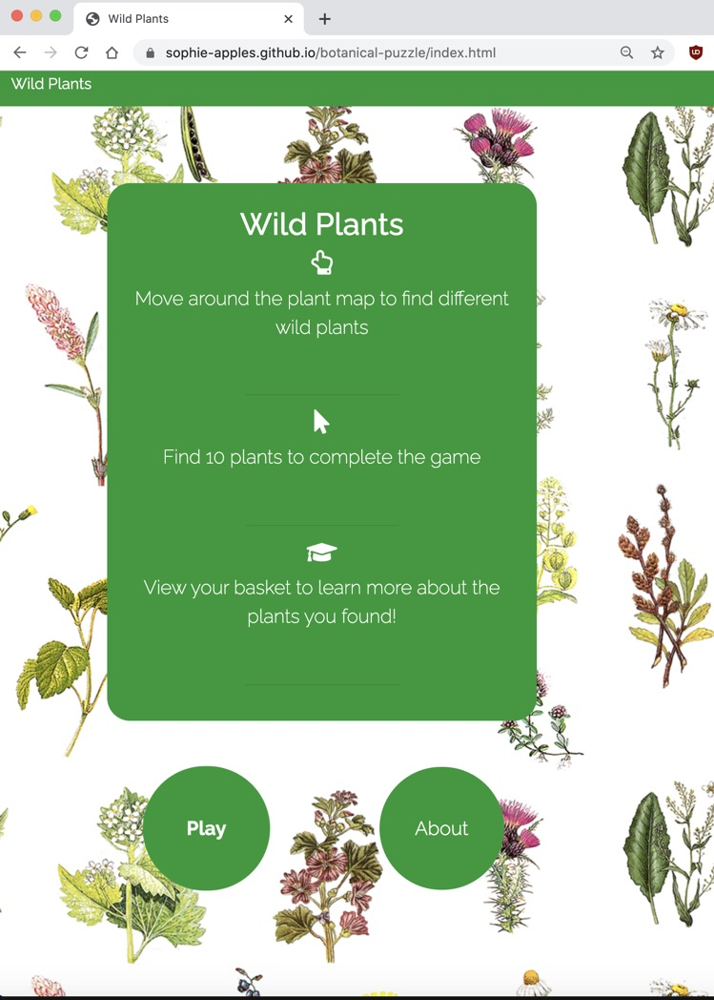
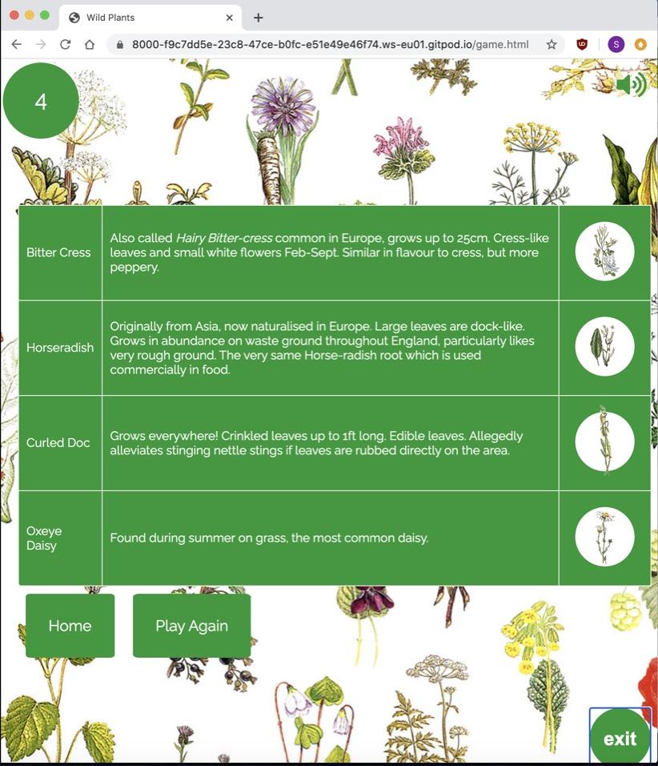
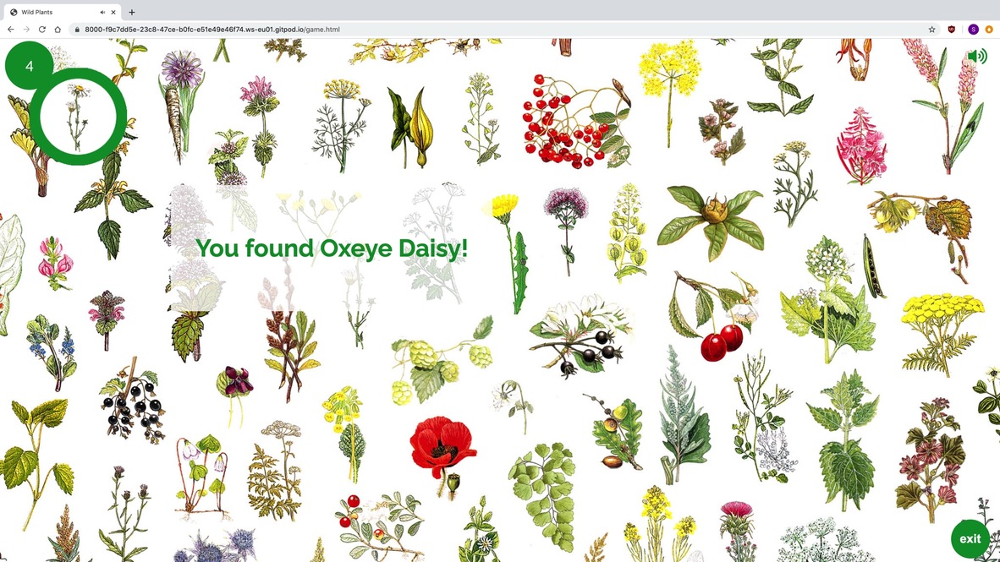
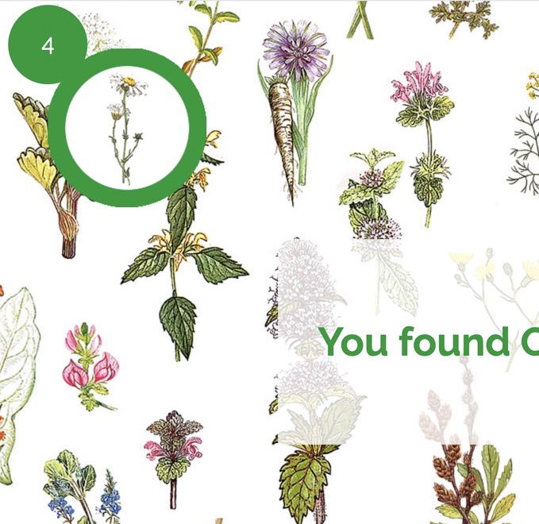
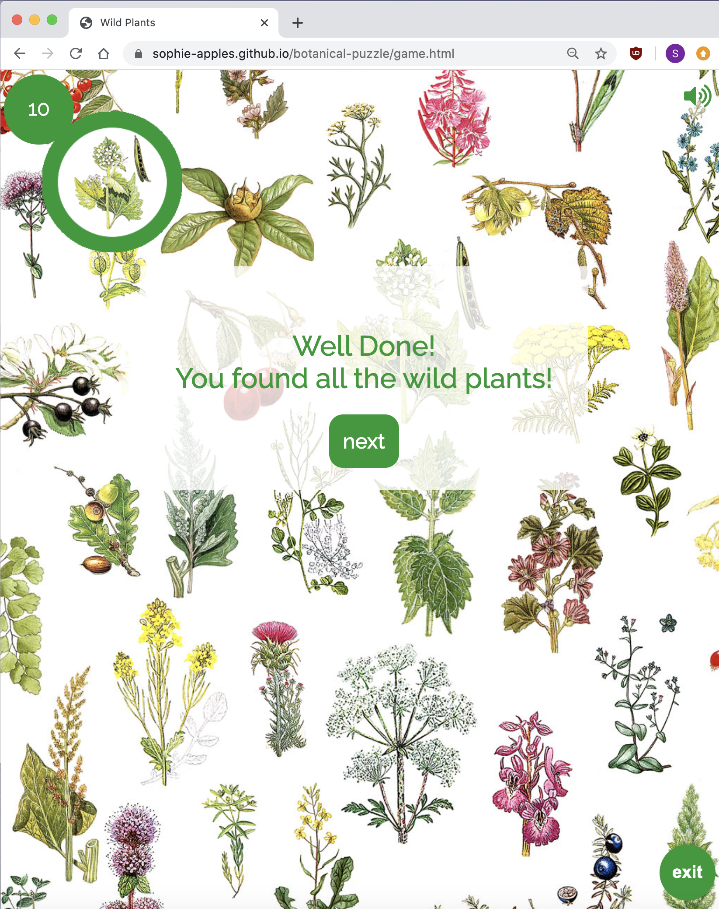
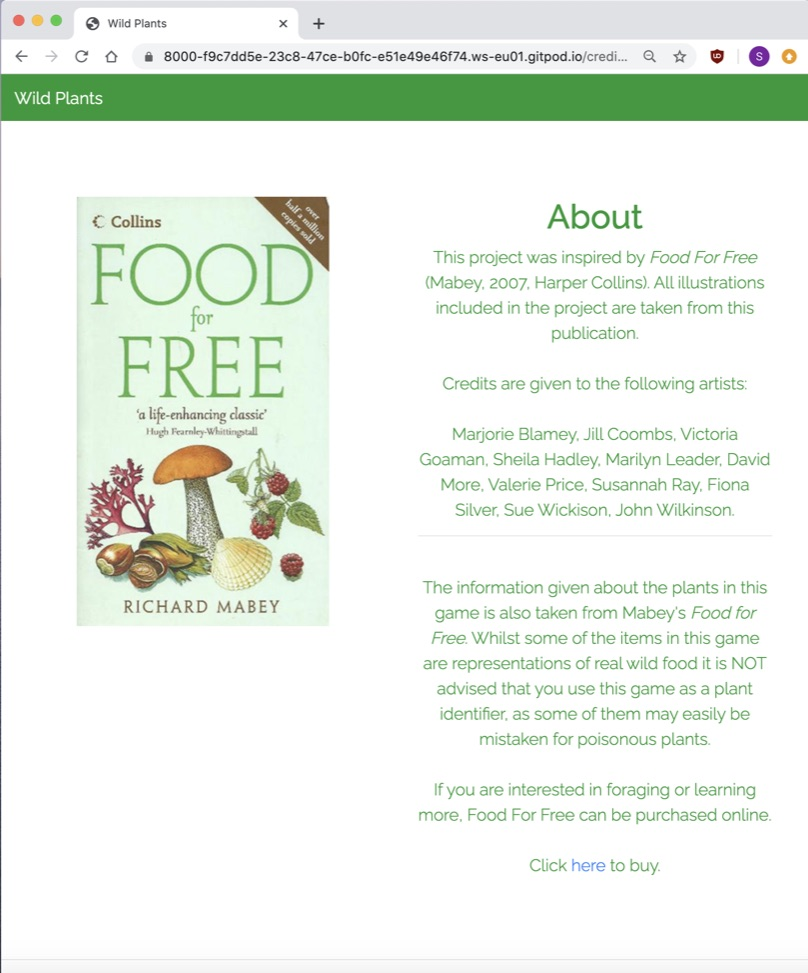
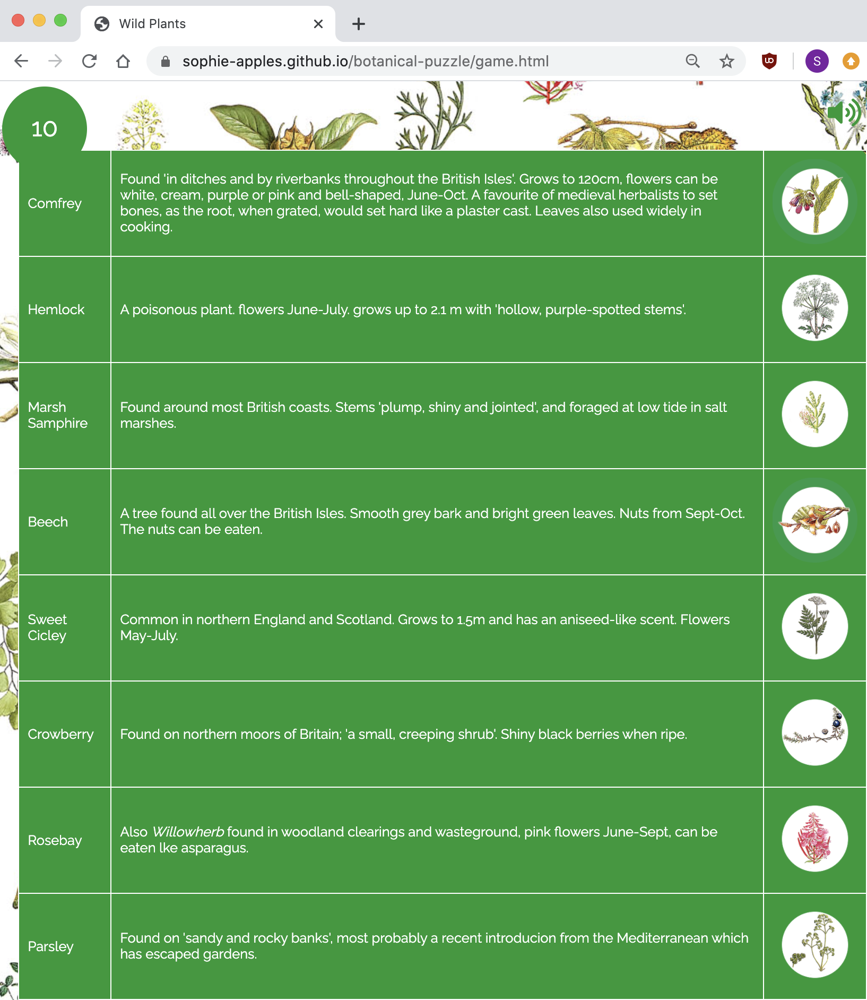

# Testing

## Code testing
[W3C Markup Validation Service](https://validator.w3.org/) was used to test the validity of the HTML code.
[W3C CSS jigsaw validation service](https://jigsaw.w3.org/css-validator/) was used to test the validity of the CSS code.
[Jshint](https://jshint.com/) was used to test the validity of the javascript code.

## Browser Compatibility testing
The web page was opened in [Mozilla Firefox](https://www.mozilla.org/en-US/firefox/download/thanks/), [Google Chrome](https://www.google.com/chrome/), [Safari](https://www.apple.com/uk/safari/) and [Microsoft Edge](https://www.microsoft.com/en-us/edge): all functional.

## Post Development Manual Testing

**General font sizing, margins, padding and content visibility, plus responsive specific elements and features (listed below) plus game functionality, to be checked at all sizes & breakpoints. Checked in four ways:**
    
1.	Via Google Chrome’s ‘inspect’ feature (motoG4, Galaxy S5, Pixel2 Pixel2sl, iPhone 5/SE, iPhone 6/7/8, iPhone 6/7/8 Plus, iPhone X, iPad, iPad Pro ) and the ‘responsive’ setting which allows horizontal and vertical resizing of the viewport.
 ** !! Note on Chrome inspect: The inspect feature in Chrome wrongly represents the layout of the game controls, modals etc. on mobile devices. I deduced this because the game was working fine and its layout was fine on the physical devices which I had available to view the project. Chrome has therefore been used to test functionality but not layout.
2.	By viewing and manually checking the website on my mobile (apple), tablet(apple), laptop(hp) and desktop(apple) devices.

3.	By opening the page in Firefox, Chrome, Edge & Safari (most used web browsers) on the different devices mentioned above.

    
_**Details below itemise elements and features to be tested with expected outcome, followed by a PASS or FAIL statement. Where an issue has been found, solution is stated after the 'FAIL' with a correction of 'PASS' if appropriate.**_

-------------------------------------------------------------------------------------------------------------------
### General
i. **Layout** no gaps at the edges of the page __PASS__

ii. **Text and formatting** everything aligned correctly, font sizing consistent, styling consistent, chosen fonts working correctly and easy to read __PASS__

iii. **Map drag behaviour** map is draggable to search for different plants __PASS__

### Home Page
i.**Instructions** correctly aligned on all devices and easy to read:__PASS__

ii.**Play button** takes user to game; correctly aligned, text responsive sizing:__PASS__

iii.**About button** visible on all devices; when clicked takes user to about page:__PASS__

iv.**Text visibility** text not obscured by background image; easy to read on all devices: __PASS__

v.**Button animation** works on all devices, cross-browser:__PASS__

### About
i.**Book photo**  responsive columns and sizing, does not obscure text, appropriate margins: __PASS__

ii.**Credits text** clear to read on all devices: __PASS__ 

iii. **Game Instructions** visible on all devices: __PASS__

iv.	**Paragraph sizes** responsive: __PASS__

v. **Font sizing** responsive, clear to read: __PASS__

vi.	**Margins** responsive and appropriate to screen size:__PASS__

vii. **Play Button** animated, link works to take user to game:__PASS__

### Game
* No errors in console during the game: __PASS__

i. **Token Image**
* A plant image is displayed in top left hand corner when game screen opens: __PASS__
* It is different each time the game loads: __PASS__
* It is clear to see and responsively sized: __PASS__

ii. **Scoreboard** 
* A scoreboard displays the user's current score: __PASS__
* It is located to the top left of the token, correctly aligned and easy to read:__PASS__
* The score updates each time a correct plant is clicked:__PASS__
* When the score is 10, the game ends:__PASS__

ii. **Plant Map** 
* Map is easy to view and navigate using drag function:__PASS__
* Is visible on different sizes. It is resizeable on mobile devices:__PASS__
* It responds to the user's click when a plant is selected:__PASS__

iii. **Correct Answer given by user**
* When correct plant picture is clicked, a modal appears to say the correct plant name: __PASS__
* The modal disappears on its own after a brief pause:__PASS__
* When correct plant picture is clicked, a bling sound plays:__PASS__
* When correct plant picture is clicked, the points icons goes up by one point:__PASS__
* When the correct plant is clicked, a new plant image is displayed in the token:__PASS__

iv. **Incorrect Answer given**
* When wrong plant is clicked, a try again modal appears:__PASS__
* The modal leaves the screen after a short pause:__PASS__
* When wrong plant is clicked, the plant image does not change and the game continues unaffected:__PASS__

v. **Exit Button**
* Clear to see and read:__PASS__
* Located in bottom right hand corner of screen:__PASS__
* When clicked, displays the 'basket' of plants the user has found so far and two buttons to choose either to navigate to 'home' or 'play again':__PASS__

vi. **Basket**
* Displays a table of the 10 plants the user has found:__PASS__
* Table text is easy to read and information is displayed about each plant, along with a thumbnail image and the name of each plant:__PASS__
* Beneth the table are two buttons 'home' and 'play again':__PASS__
* The 'home' button navigates to the home page when clicked:__PASS__
* The 'play again' button restarts the game when clicked:__PASS__
* If the game has been exited early, the number of plants the user has found so far is displayed:__PASS__

vii. **Sound Controls**
* Button to switch sound on and off in top right hand corner:__PASS__
* When window opens, a button to switch sound on is displayed:__PASS__
* When that button is clicked, the sound plays and the icon changes to a button to switch sound off:__PASS__
* When it is clicked again, then sound is turned off:__PASS__

viii.**End of Game**
* When 10 plants are found, no more plants are displayed in the token:__PASS__
* When 10 plants ahve been found, a modal appears saying that all the plants have been found:__PASS__
* Beneath the modal, a button is displayed saying 'next'. When clicked, the next button takes the user to the 'basket', as described above:__PASS__

## Testing during development : JavaScript
* As each function was created, is was tested individually for functionality.
* Once individual functions were working, they were grouped together, and tested again.
* At every step and stage of development and implementation of the project, the javascript functionality was tested and re-tested using live demos on mobile, tablet and desktop devices, and changed when and where necessary.
* Chrome inspect tools were utlilised, and the console checked regularly to ensure no errors were occuring. 
* Where possible, variables have been declared inside functions, but in some cases it was necessary or appropriate to declare global variables so that the code worked. 
For example, score, selectedPlantIndex and selectedPlant needed to be global let values as their value is used and changed elsewhere in the code as the game progresses.
* The code has been run through jshint checker at various stages along the way to make sure that no obvious problems were occuring.

### Notes on problems found during testing and problems during development
* A huge barrier to finishing this project has been testing. The inspect feature in Chrome wrongly represents the layout of the game controls, modals etc. on mobile devices. I deduced this because the game was working fine and its layout was fine on the physical devices which I had available to view the website. I did not have access to android devices.
* The necessity of delcaring some variables outside of functions due to their need to be accessed from elsewhere in the code.
* Decision to include Plants array in a seperate js file to keep code tidy. The way in which the plants array has been included in this project was down to advice from course tutors, who felt that it was unnecessary, given the scope of this project, to fetch the data.
* Decision to put drag function inside a seperate js file also to keep code tidy, and because the functionality is to do with the navigation of the website and the game page, rather than the actual game process functionality. For me it made logical sense to separate it.

## Testing user stories

### "I want the game to be easy to use and have clear instructions."

 
### "I want to find out something different each time I play."

 
### "I want to feel like I am learning and improving as I play, and start to recognise the plants and remember things about them."

 
### "I want feedback on how I am doing."

 
### "I want a chance to find out more about the topic."

 
### "I want to discover interesting facts."

 
### "I want to play a game which is visually attractive."

